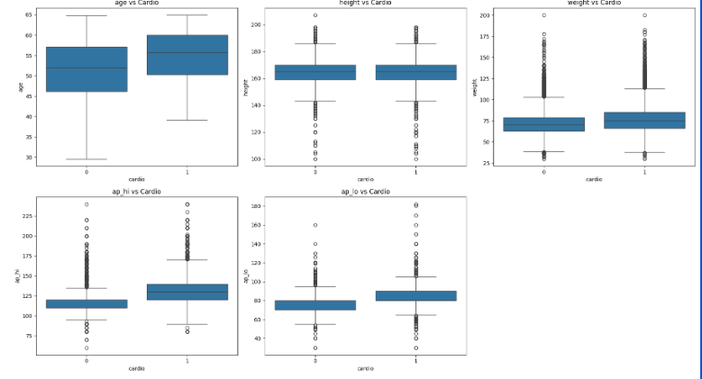
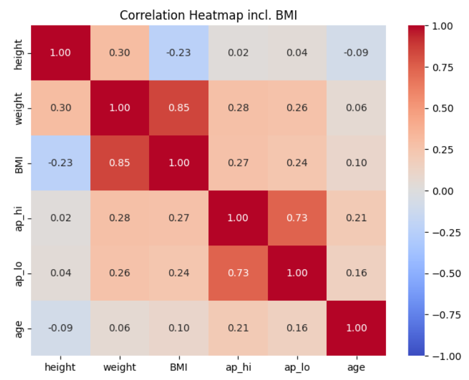
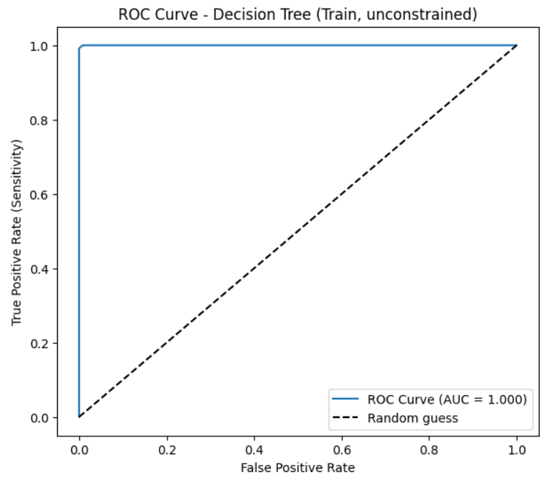
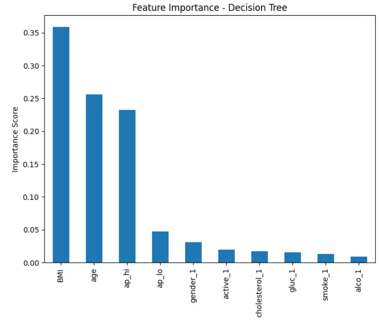

# CardioRisk Prediction — Classifying Cardiovascular Disease Risk

Built and compared machine learning classifiers to predict whether a patient is at risk of cardiovascular disease, based on demographic, physiological, and lifestyle attributes. The goal was to find a model that balances predictive accuracy with interpretability for clinical screening use cases.

**Tools used:** pandas, numpy, matplotlib, seaborn, scikit-learn

## Key Insights

**Blood pressure and age showed the clearest separation between at-risk and not-at-risk patients**, while height showed almost no predictive signal — a useful early read on which features would matter.

**Physiological measurements are only weakly correlated with each other**, meaning most features carried distinct, non-redundant information for the model to learn from.

**An unconstrained Decision Tree overfit badly** — 100% training accuracy but only 63% test accuracy, a 37-point gap. The ROC curve below (AUC = 1.000 on training data) shows this clearly: a perfect curve is a textbook sign of memorization, not generalization. Hyperparameter tuning via grid search closed this gap substantially, bringing test performance up to ~72–73% accuracy.

**Three tuned models — Linear SVM, Tuned Decision Tree, and Tuned RBF SVM — converged to nearly identical performance** (72.4–72.6% accuracy, 0.79–0.794 AUC). The non-linear RBF kernel gave no meaningful improvement over the linear model, suggesting the underlying relationship between features and cardiovascular risk is largely linear.

**BMI, age, and blood pressure (systolic and diastolic) emerged as the strongest predictors** in the tuned Decision Tree's feature importance ranking, aligning with established clinical risk factors — lifestyle factors like smoking and alcohol use contributed comparatively little.

## What's Covered

1. Data understanding and initial inspection
2. Data cleaning — physiological validity checks, unit conversions (age, height), data type fixes
3. Exploratory data analysis — univariate, bivariate, and correlation analysis
4. Train-test split (70:30, stratified)
5. Feature engineering — BMI creation, category consolidation, dummy encoding, scaling
6. Model building — Linear SVM, Decision Tree, hyperparameter-tuned Decision Tree and RBF SVM
7. Final model evaluation, selection, and model cards for each candidate

## Data Source

A health survey dataset of ~70,000 patient records with physiological measurements and a binary cardiovascular disease label, cleaned down to ~68,645 valid records.

## Notebook

See [`CardioRisk_Prediction_Project.ipynb`](CardioRisk_Prediction_Project.ipynb) for the full analysis.
